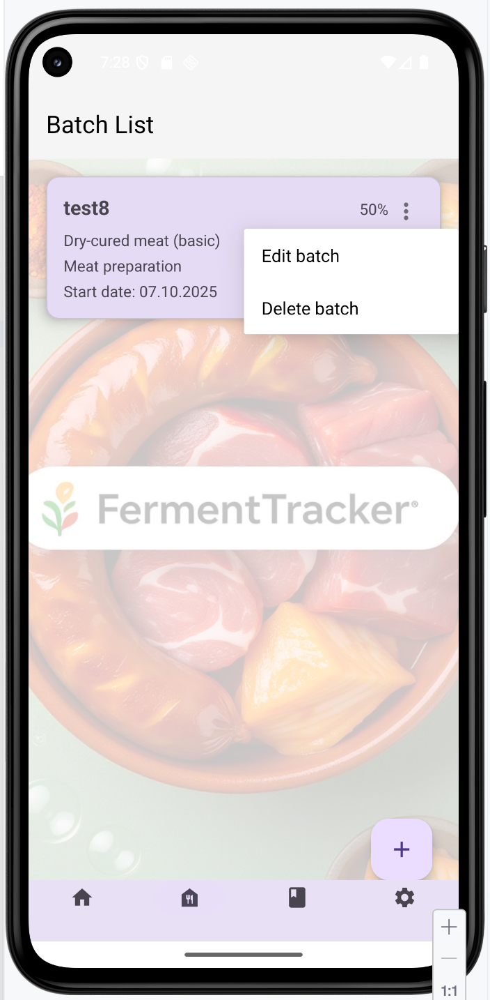
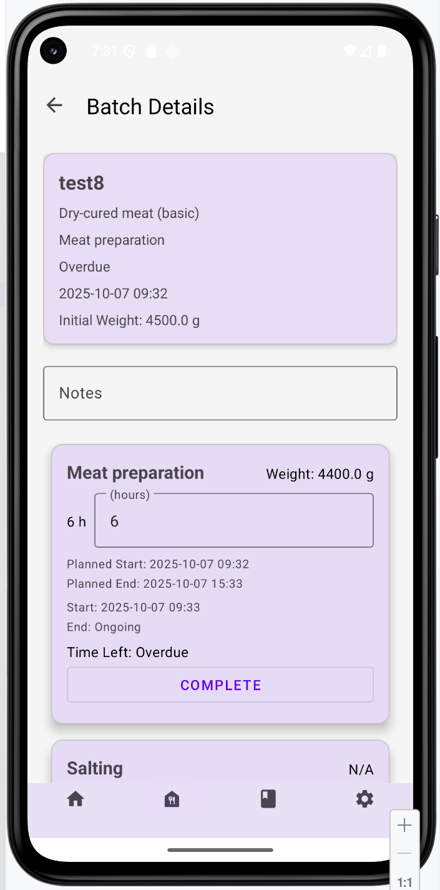
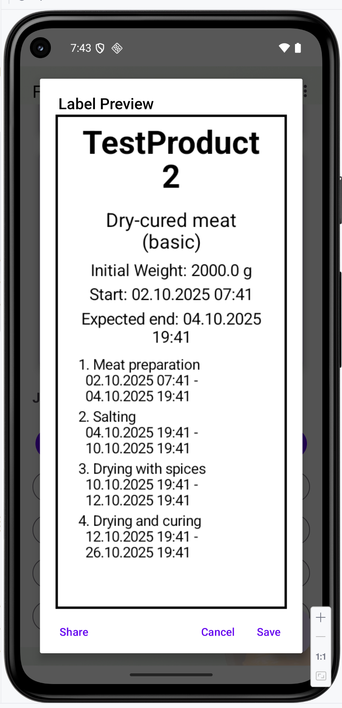

# FermentTracker

## English Version

### Overview
FermentTracker is an Android application designed to help users manage and track fermentation processes, such as brewing or food fermentation. It allows users to create batches, monitor stages, add photos, generate QR codes for batch details, and export data. This app is ideal for hobbyists and professionals who need an organized way to oversee their fermentation projects.

### Features
- **Batch Management**: Create, view, and delete fermentation batches with details like name, product type, and start date.
- **Stage Tracking**: Monitor multiple stages of fermentation (e.g., Fermentation, Aging) with start/end times and weight updates.
- **Photo Integration**: Capture and store photos for each stage using the device camera.
- **QR Code Generation**: Generate QR codes for batch IDs to share or save batch information.
- **Data Export**: Share QR codes via messaging apps or save them to the device.
- **Swipe-to-Delete**: Easily remove batches with a swipe gesture.
- **Template Editing**: Add and edit preparation templates for recurring processes.

### Screenshots

|  Main screen (swipe)     |  Detailed info (page1)    |  Detailed info (page2)    | Create new product        |
|--------------------------|---------------------------|---------------------------|---------------------------|
|  |  |  |  |

### Screenshots

| Print label                 | Edit recipes                | recipes's list              | Export/Import               |
|-----------------------------|-----------------------------|-----------------------------|-----------------------------|
|  |  |  |  |

*(Note: Replace these URLs with actual screenshot links hosted on GitHub or another service.)*

### Technology Stack
- **Language**: Kotlin
- **Framework**: Android Jetpack (Navigation, ViewModel, LiveData, Room)
- **UI**: XML Layouts, Material Design Components
- **Libraries**:
    - `androidx.navigation:navigation-fragment-ktx`
    - `androidx.recyclerview:recyclerview`
    - `com.google.android.material:material`
    - `com.google.zxing:core` (for QR code generation)
- **Build Tools**: Gradle
- **Version Control**: Git

### Installation
1. Clone the repository:
   ```bash
   git clone https://github.com/wizand0/FermentTracker.git
   ```
2. Open the project in Android Studio.
3. Sync the project with Gradle files.
4. Ensure you have the required dependencies installed (see build.gradle).
5. Build and run the app on an emulator or physical device with Android 5.0 (API 21) or higher.

### Current Version
- Version: 1.25
- Release Date: October 13, 2025
- Notes: Initial release with core fermentation tracking features. Future updates will include data persistence improvements and additional export options.

### Data Backup Policy

- Android Auto Backup is **disabled** (`android:allowBackup="false"`).
- Custom `backup_rules.xml` excludes:
    - All databases
    - SharedPreferences with sensitive data (auth, tokens, etc.)
    - Cache directories

### Data Export & Import

- Export and import of data are handled **only through the app’s UI**.
- Exported data does **not** contain secrets or authentication tokens.
- Users can safely back up recipes and logs via UI options.


### Contributing
We welcome contributions! To contribute:
1. Fork the repository.
2. Create a new branch for your feature or bug fix:
```bash
git checkout -b feature-name
```

3. Commit your changes:
```bash
git commit -m "Description of changes"
```

4. Push to the branch:
```bash
git push origin feature-name
```

5. Open a pull request with a clear description of your changes.

### License
This project is licensed under the MIT License. See the LICENSE file for details.
### Contact
For questions or support, please open an issue on GitHub or contact the maintainer at makandrei@gmail.com.