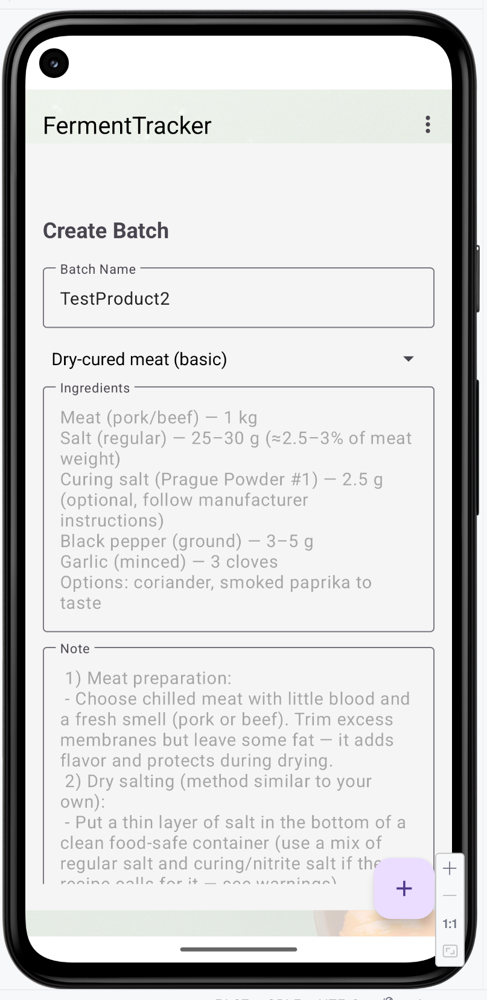

# FermentTracker

## English Version

### Overview
FermentTracker is an Android application designed to help users manage and track fermentation processes, such as brewing or food fermentation. It allows users to create batches, monitor stages, add photos, generate QR codes for batch details, and export data. This app is ideal for hobbyists and professionals who need an organized way to oversee their fermentation projects.

### Features
- **Batch Management**: Create, view, and delete fermentation batches with details like name, product type, and start date.
- **Stage Tracking**: Monitor multiple stages of fermentation (e.g., Fermentation, Aging) with start/end times and weight updates.
- **Photo Integration**: Capture and store photos for each stage using the device camera.
- **QR Code Generation**: Generate QR codes for batch IDs to share or save batch information.
- **Data Export**: Share QR codes via messaging apps or save them to the device.
- **Swipe-to-Delete**: Easily remove batches with a swipe gesture.
- **Template Editing**: Add and edit preparation templates for recurring processes.

### Screenshots

|  Main screen (swipe)     |  Detailed info (page1)    |  Detailed info (page2)    | Create new product        |
|--------------------------|---------------------------|---------------------------|---------------------------|
|  |  |  |  |

### Screenshots

| Print label                 | Edit recipes                | recipes's list              | Export/Import               |
|-----------------------------|-----------------------------|-----------------------------|-----------------------------|
|  |  |  |  |

*(Note: Replace these URLs with actual screenshot links hosted on GitHub or another service.)*

### Technology Stack
- **Language**: Kotlin
- **Framework**: Android Jetpack (Navigation, ViewModel, LiveData, Room)
- **UI**: XML Layouts, Material Design Components
- **Libraries**:
    - `androidx.navigation:navigation-fragment-ktx`
    - `androidx.recyclerview:recyclerview`
    - `com.google.android.material:material`
    - `com.google.zxing:core` (for QR code generation)
- **Build Tools**: Gradle
- **Version Control**: Git

### Installation
1. Clone the repository:
   ```bash
   git clone https://github.com/wizand0/FermentTracker.git
   ```
2. Open the project in Android Studio.
3. Sync the project with Gradle files.
4. Ensure you have the required dependencies installed (see build.gradle).
5. Build and run the app on an emulator or physical device with Android 5.0 (API 21) or higher.

### Current Version
- Version: 1.21
- Release Date: October 08, 2025
- Notes: Initial release with core fermentation tracking features. Future updates will include data persistence improvements and additional export options.

### Contributing
We welcome contributions! To contribute:
1. Fork the repository.
2. Create a new branch for your feature or bug fix:
```bash
git checkout -b feature-name
```

3. Commit your changes:
```bash
git commit -m "Description of changes"
```

4. Push to the branch:
```bash
git push origin feature-name
```

5. Open a pull request with a clear description of your changes.

### License
This project is licensed under the MIT License. See the LICENSE file for details.
### Contact
For questions or support, please open an issue on GitHub or contact the maintainer at makandrei@gmail.com.

## Русская версия
### Обзор
FermentTracker — это приложение для Android, разработанное для помощи пользователям в управлении и отслеживании процессов ферментации, таких как приготовление пива или ферментация продуктов питания. Приложение позволяет создавать партии, отслеживать этапы, добавлять фотографии, генерировать QR-коды для деталей партий и экспортировать данные. Оно идеально подходит как для любителей, так и для профессионалов, которым нужен организованный способ контроля над проектами ферментации.
### Функции

- Управление партиями: Создание, просмотр и удаление партий ферментации с деталями, такими как название, тип продукта и дата начала.
- Отслеживание этапов: Мониторинг нескольких этапов ферментации (например, Ферментация, Выдержка) с временем начала/окончания и обновлением веса.
- Интеграция фотографий: Съёмка и хранение фотографий для каждого этапа с помощью камеры устройства.
- Генерация QR-кодов: Создание QR-кодов для идентификаторов партий для обмена или сохранения информации.
- Экспорт данных: Обмен QR-кодами через мессенджеры или сохранение на устройстве.
- Swipe-to-Delete: Удобное удаление партий с помощью свайпа.
- Редактирование шаблонов: Добавление и редактирование шаблонов подготовки для повторяющихся процессов.

### Скриншоты

| Главный экран (свайп)       | Детальная информация ч1     | Детальная информация ч2     | Создание нового продукта    |
|-----------------------------|-----------------------------|-----------------------------|-----------------------------|
|  |  |  |  |


### Стек технологий

- Язык: Kotlin
- Фреймворк: Android Jetpack (Navigation, ViewModel, LiveData, Room)
- Интерфейс: XML Layouts, Material Design Components
- Библиотеки:
- androidx.navigation:navigation-fragment-ktx
- androidx.recyclerview:recyclerview
- com.google.android.material:material
- com.google.zxing:core (для генерации QR-кодов)
- Инструменты сборки: Gradle
- Контроль версий: Git

### Установка

1. Склонируйте репозиторий:
```bash
git clone https://github.com/yourusername/FermentTracker.git
```

2. Откройте проект в Android Studio.
3. Синхронизируйте проект с файлами Gradle.
4. Убедитесь, что установлены все необходимые зависимости (см. build.gradle).
5. Соберите и запустите приложение на эмуляторе или физическом устройстве с Android 5.0 (API 21) или выше.

### Текущая версия

- Версия: 1.21
- Дата выпуска: 08 октября 2025 года
Примечания: Начальный релиз с основными функциями отслеживания ферментации. Будущие обновления включат улучшения хранения данных и дополнительные опции экспорта.

### Участие в разработке
Мы рады вкладам! Чтобы внести свой вклад:

1. Сделайте форк репозитория.
2. Создайте новую ветку для вашей функции или исправления ошибки:
```bash
git checkout -b feature-name
```

3. Зафиксируйте изменения:
```bash
git commit -m "Описание изменений"
```

4. Отправьте изменения в ветку:
```bash 
git push origin feature-name
```

5. Откройте pull request с чётким описанием ваших изменений.

### Лицензия
Этот проект лицензирован по лицензии MIT. См. файл LICENSE для деталей.
### Контакты
Для вопросов или поддержки, пожалуйста, откройте issue на GitHub или свяжитесь с автором по адресу makandre@gmail.com.